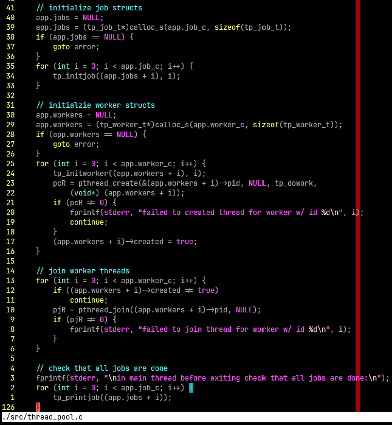
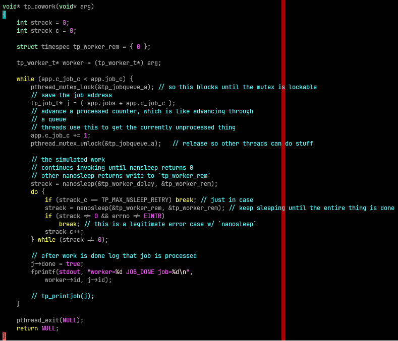

# COMP7005 Lab4 Report

Will Otterbein, A01372608

## `main`

The main function first processes the arguments strictly rejecting any invalid
argument count (n != 3), and parsing the two arguments as integers.

Then main sets up the application state. To make things easy, jobs & workers
are assigned types, `tp_job_t` & `tp_worker_t` respectively, and the application
state is grouped under the `tp_state_t` struct instance `app`. Heap memory
is allocated for all the jobs & workers, as per the inputs of the program, &
written to `app.workers` & `app.jobs`. The inital worker & job counts are also
written to the application state as `app.worker_c` & `app.job_c`. The completed
job counter, `app.c_job_c` , is set to 0.

For each job, `tp_job_t` structs are initialized w/ ascending id
number & the other fields are zeroed as per `tp_initjob`, written the the
corresponding index of `app.jobs`.

For each worker, `tp_worker_t` structs are initialized w/ ascending id numbers
& the other fields are initialized as per `tp_initworker`. Additionally, 
`pthread_create` is invoked for the thread, where the routine is specified as
`tp_dowork` & to that routine the current job struct is passed. `pthread_create`
writes the pid to the structs `pid` field. If `pthread_create` fails, we print this
& the `created` field of the `tp_worker_t` instance remains `false`, or 0.

Now that the workers are running, main has to wait for all the workers to finish.
The `app.workers` memory is iterated over, & `pthread_join` is called for each
worker (unless the worker `created` field is set to `false`). If there's an
error joining the thread, we print this.

Finally we just have a simple sanity check to log all the jobs & confirm that
their state is set to done. Also the heap memory allocated for `app.workers` &
`app.jobs` is freed. In the regular case, the exit code is 0.

Like my other labs, error conditions jump to an `error` label, which also
frees the `app.workers` & `app.jobs` memory (if the pointer is not the 
default uninitialized value of NULL) and the program returns a non zero
exit code.

## `tp_dowork`

This function is the thread routine.

For its argument it accepts (expects) a pointer to the `tp_worker_t` type for
that worker (in a more complicated application this might be more useful, I
just use it to get that workers ID for the log message).

The processing logic begins with the `while` loop. The immediate condition
check against the job count, `app.job_c`, & processed job offset, `app.c_job_c`,
stops the threads from processing after the entire queue of jobs has been
processed.

Regarding the processing, to ensure mutual exclusion while the threads are
dequeuing jobs, the shared mutex `tp_jobqueue_a` must be acquired. If this cannot
be done, `pthread_mutex_lock` takes care of blocking the calling thread for us.
Otherwise the lock is acquired, the address of the current job to process is
saved by the acquiring thread using the processed job offset, who is also responsible to advance the processed
job offset (which is effectively like dequeuing the job).

The method initializes a `tp_worker_rem` timespec struct instance, which
is used to write `nanosleep` remainder time in order that sleep be reattempted
until the entire duration of 2 seconds has elapsed.

Once the fake work (`nanosleep`) is complete, the thread exits.

> Sleep retries a maximum of 10 times before the retry loop is broken out of (defined by `TP_MAX_NSLEEP_RETRY`).
